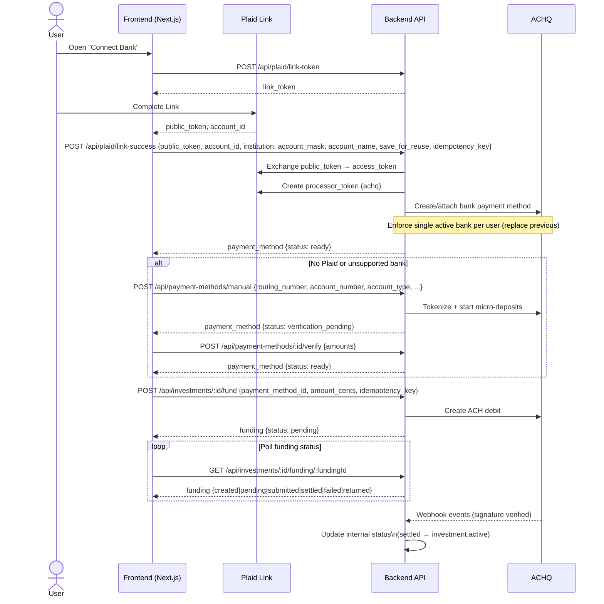

## Plaid + ACHQ Integration: Frontend–Backend Contract

### Summary and Constraints
- Goal: Investors fund investments via ACH using Plaid Link (primary) or manual entry (fallback), and we reuse the saved bank for future investments and payouts.
- Investment range: $1,000 minimum; ACH allowed up to $100,000 (wire enforced above that by FE).
- Bank accounts per user: Single active bank on file. When a user adds a new bank, replace the previous one in storage. UI still allows “Add New Bank”.
- No minimum balance check: Do not enforce any available balance checks before selection.

### Visual Overview


### Diagram Notes (Backend Requirements)
- Implement the endpoints exactly as named in this doc; return shapes as shown.
- On `/api/plaid/link-success`: exchange `public_token`, create Plaid `processor_token` (achq), attach/create ACHQ bank, and enforce one-bank policy.
- On `/api/payment-methods/manual`: validate ABA, tokenize with ACHQ, initiate micro-deposits, return `status: verification_pending`; verify via `/verify` to become `ready`.
- On `/api/investments/:id/fund`: create an idempotent ACH debit at ACHQ and return a `funding` handle; FE will poll status until webhook-driven settlement.
- Webhooks: verify ACHQ signature and map events to canonical statuses; only mark investment `active` on `settled`.
- Idempotency: FE supplies `idempotency_key`; store and dedupe per user/action.
- No balance checks before allowing funding initiation.

### Primary Flow: Plaid Link → ACHQ Payment Method
1) FE requests link token
   - POST `/api/plaid/link-token`
   - Req: `{ "use_case": "processor", "client_app": "web" }`
   - Res: `{ "link_token": string, "expiration": string }`

2) User completes Plaid Link (FE)
   - FE receives `public_token` and `account_id` (plus metadata)

3) FE notifies backend to create payment method (processor token)
   - POST `/api/plaid/link-success`
   - Req:
     ```json
     {
       "public_token": "public-...",
       "account_id": "acc_...",
       "institution": { "id": "ins_...", "name": "Chase" },
       "account_mask": "1234",
       "account_name": "Checking",
       "save_for_reuse": true,
       "idempotency_key": "uuid-v4"
     }
     ```
   - Backend actions:
     - Exchange `public_token` → `access_token` (Plaid `/item/public_token/exchange`)
     - Create Plaid `processor_token` with processor=`achq` (Plaid `/processor/token/create`)
     - Create/attach ACHQ payment method to the customer (replace any previous bank on file)
     - Persist single active bank; return normalized payment method
   - Res:
     ```json
     {
       "payment_method": {
         "id": "pm_123",
         "type": "bank_ach",
         "display_name": "Chase Checking ••1234",
         "bank_name": "Chase",
         "account_type": "checking",
         "last4": "1234",
         "status": "ready",
         "created_at": "ISO"
       }
     }
     ```

### Fallback: Manual Entry → ACHQ Tokenization + Micro-Deposits
1) FE allows entering routing/account numbers when a bank isn’t on Plaid
   - POST `/api/payment-methods/manual`
   - Req:
     ```json
     {
       "account_holder_name": "John Doe",
       "routing_number": "021000021",
       "account_number": "1234567890",
       "account_type": "checking",
       "save_for_reuse": true,
       "idempotency_key": "uuid-v4"
     }
     ```
   - Backend actions:
     - Validate routing number (ABA)
     - Create ACHQ customer if needed
     - Tokenize bank account at ACHQ and initiate micro-deposits
     - Persist single active bank with `status: "verification_pending"` (replace previous)
   - Res: `payment_method` with `status: "verification_pending"`

2) Micro-deposit verification
   - POST `/api/payment-methods/:id/verify`
   - Req: `{ "amounts": [32, 45] }` (values in cents)
   - Res: `payment_method` now `status: "ready"` on success

### Funding an Investment via ACH (≤ $100,000)
1) FE submits investment then initiates funding
   - POST `/api/investments/:investmentId/fund`
   - Req:
     ```json
     {
       "payment_method_id": "pm_123",
       "amount_cents": 100000, // $1,000 minimum enforced by FE earlier
       "idempotency_key": "uuid-v4",
       "memo": "Investment 1001"
     }
     ```
   - Res:
     ```json
     {
       "funding": {
         "id": "fund_abc",
         "status": "pending",
         "amount_cents": 100000,
         "achq_transaction_id": "achq_txn_...",
         "created_at": "ISO",
         "expected_settlement_date": "ISO"
       }
     }
     ```

2) FE polls funding status
   - GET `/api/investments/:investmentId/funding/:fundingId`
   - Res: `{ "funding": { "status": "created|pending|submitted|settled|failed|returned", ... } }`

3) ACHQ webhook → backend updates
   - POST `/webhooks/achq`
   - Verify signature; map ACHQ events to internal statuses; if `settled`, set investment to `active`.

4) Wire transfer path (>$100k)
   - FE instructs user with wire details; no ACH call.

### Payouts (Later)
- Use the same stored single bank method to send credits via ACHQ (e.g., monthly payouts).
- Proposed endpoint: POST `/api/payouts` with `{ payment_method_id, amount_cents, idempotency_key }`.

### Error Model
All errors:
```json
{ "error": { "code": "invalid_request", "message": "...", "details": { } } }
```
Codes: `400 invalid_request`, `401 unauthorized`, `409 relink_required`, `422 unsupported_account`, `429 rate_limited`, `500 server_error`.

### Idempotency
- FE supplies `idempotency_key` on `/plaid/link-success` and `/investments/:id/fund`.
- Backend stores keys per user/action to avoid duplicate processor-token creation and duplicate debits.

### Environment Variables
- Backend: `PLAID_CLIENT_ID`, `PLAID_SECRET`, `PLAID_ENV`, `ACHQ_API_KEY`, `ACHQ_BASE_URL`, `ACHQ_WEBHOOK_SECRET`.
- Frontend: `NEXT_PUBLIC_PLAID_ENV` (sandbox/development/production).

### One-Bank Policy (Important)
- Maintain a single active bank account per user.
- On new Plaid link or manual entry, replace the previous bank in storage and return only the latest in `GET /api/payment-methods?type=bank_ach`.

### No Balance Check
- Do not perform any minimum balance validation before allowing selection or funding initiation.

### Sequence Diagram (Text)
```
User → FE: Open "Connect Bank"
FE → BE: POST /api/plaid/link-token → link_token
User → Plaid: Complete Link (select account)
Plaid → FE: public_token + account_id
FE → BE: POST /api/plaid/link-success (idempotent)
BE → Plaid: exchange public_token → access_token
BE → Plaid: create processor_token (achq)
BE → ACHQ: create payment method; replace previous bank
BE → FE: payment_method { status: ready }
FE → BE: POST /api/investments/:id/fund (idempotent)
BE → ACHQ: create ACH debit
ACHQ → BE (webhook): updates (pending → settled/failed/returned)
FE → BE: GET funding status (poll)
```

### Open Decisions Applied
- On funding failures: keep investment pending until funding `settled`; do not transition to active until webhook confirms settlement.
- Single bank policy implemented at backend; FE keeps the UI but only receives one active method from the list endpoint.


